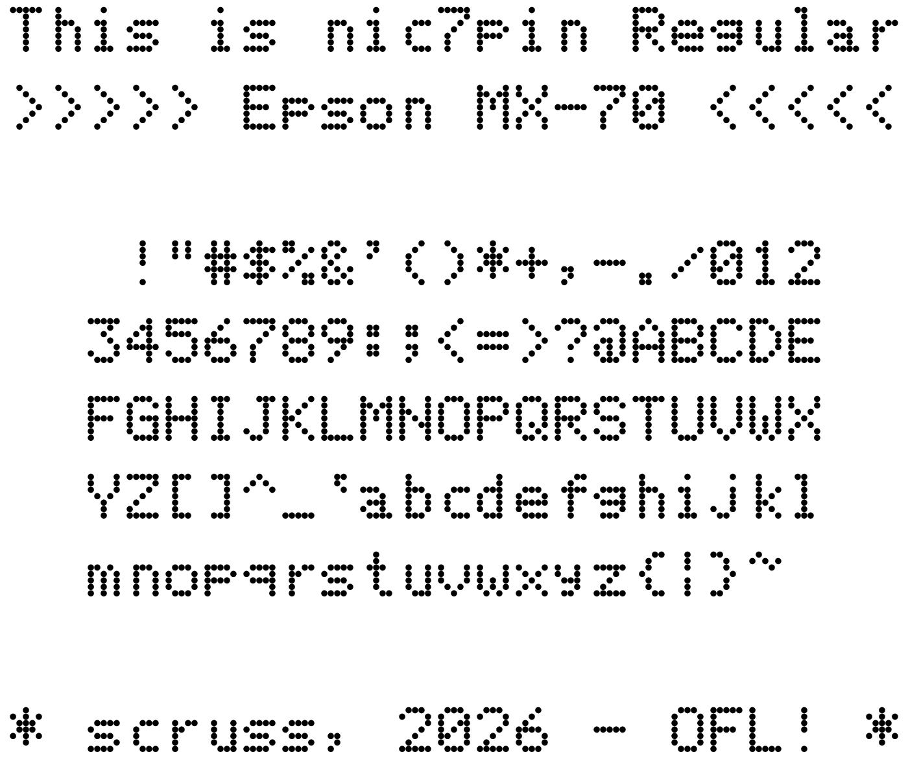

# nic7pin

Stewart Russell — 2026-06

A rendering of a 7-pin dot matrix font, as used by the Epson MX-70
reduced-cost printer from the mid-1980s.

## Name

Seiko Epson Corporation is named as &ldquo;son of
[EP-101](https://corporate.epson/en/about/history/milestone-products/1968-9-ep-101.html)&rdquo;,
for the world's first compact, lightweight digital printer. I'm
Scottish, and in Scots Gaelic &ldquo;son of&rdquo; is
*mac*. Unfortunately, that prefix has been co-opted by an overpriced
computer vendor. In Gaelic, *nic* means &ldquo;daughter of&rdquo;, so
as an oblique compliment to Epson, this font is named *daughter of 7
pin*. It seemed like a good idea at the time&nbsp;&hellip;

## Coverage

ASCII.

## Design Size

The 12 point design size is meant to reproduce 12 characters per inch
horizontally, and six lines per inch vertically.

## Source

While this font is produced entirely by one Python
[FontForge](https://fontforge.org/) script, the code is too ugly for
you to look at. The included `mx70.json` is likely more useful: it
contains all of the pin definitions keyed by character name.

## Licence

© 2026 - Stewart Russell, scruss.com
with Reserved Font Name nic7pin

This Font Software is licensed under the SIL Open Font Licence,
Version 1.1.  https://openfontlicense.org/

[I do not agree with SIL's missionary work in any way, and the use of
this licence isn't an endorsement of SIL.]

## References

* [Epson MX-70 User's
  Manual](https://files.support.epson.com/pdf/mx70__/mx70__u1.pdf),
  Appendix C: Character Set (p.83)
  
* [identify this peripheral - Identifying a dot-matrix printer from
  its font - no descenders, no half-pixel shift, mid/late 1980's -
  Retrocomputing Stack
  Exchange](https://retrocomputing.stackexchange.com/questions/32688/identifying-a-dot-matrix-printer-from-its-font-no-descenders-no-half-pixel-sh)
  &mdash; where I found out about this silly thing.

